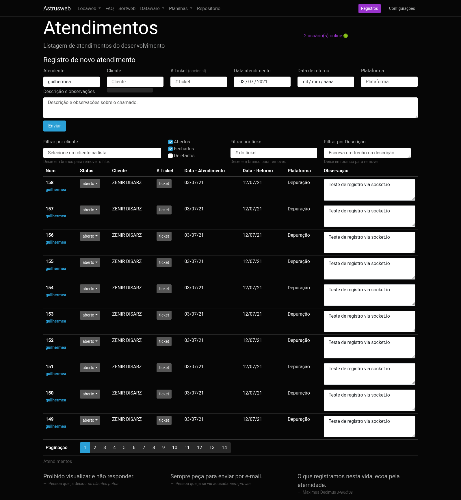

# Atendimento To-Do!

Dynamic tables to register technical support tickets.

Objectives:

1. Facilitate registration of technical support tickets.
2. Faster search for tasks delegated to the development team.
3. Account for time dedicated in customer service.
4. Integrate to different project management services via API.

Technical information:

- Backend in [node.js](https://nodejs.org/) v15.14.0
- Routing and API in [express.js](https://expressjs.com/) v4.17.1
- [socket.io](https://socket.io/) v4.1.2 to sync table updates between different users.
- Database mysql 5.7, via [mysql2](https://www.npmjs.com/package/mysql2) v2.2.5
- Frontend using ES6 notation.
- Styles and UX based on [bootstrap](https://getbootstrap.com/) using [cyborg](https://bootswatch.com/cyborg/) theme.


## GLITCHES

*Pendentes*

- quando digitar 'c', achar resultado com 'ç', 'a', achar resultado com 'á', etc...
- como a paginação está dentro do rodapé da tabela, se coloca por ex. 10 por pagina, fica muito comprido e desformata a tabela
- novos atendimentos ficam com as datas de atendimento e retorno no formato errado.
- em alguns casos a aba registros do usuário não está sendo populada, sem deixar nenhum erro no console.
- ao marcar uma opção de filtro, por ex. aberto e deletado, e dar F5, o navegador mantém as checkbox marcadas mas não ativa o filtro.
- Caso a pessoa estiver filtrando por atendimentos fechados, e outro usuário inserir uma linha, ela vai aparecer mesmo assim.
- Validação do user\_id na inserção de linha, acho que tá deixando passar pro query no banco ids que não existem. verificar e fazer igual tá com a verificação do client\_id.
- (em análise, pode causar transtorno caso a pessoa queira atualizar a lista...) Evitar que a pessoa possa enviar várias vezes o mesmo filtro, por ex, travar o filtro pelo cliente que já está sendo filtrado...
- (em análise, foi adiciona função pra fechar interação com o banco [ver](https://github.com/guites/socket-tables/blob/main/db/db.js#L7)) Criar conexão com o banco uma única vez, ao invés de criar toda vez que é feito um query:
```javascript
const mysql = require('mysql2/promise');
const config = require('./config');
// const connection = await mysql.createConnection(config);
// passar connection como parametro nas funções

async function query(sql, params = null) {
  const connection = await mysql.createConnection(config);
  const [results, ] = await connection.execute(sql, params);
  return results;
}
```
- Aplica o filtro com o perPage em 10, num cliente que tem 30 entradas. Altera o perPage pra 100 e clica na terceira página => cai numa página com 100% filler rows.
- Quando um usuário estiver utilizado o filtro, ele já carregou os clientes com atendimento no cache. Se for criado um atendimento pra um cliente diferente dos que existiam, ele não vai aparecer na listagem de clientes pra filtro até que o usuário atualize a página.
- Alguns clientes quando são colocados no filtro, retornam a listagem com todas as linhas filler (possivelmente pq os atendimentos deles estão todos deletados)
- Quando entra no campo cliente sem clicar, dá aquele problema do bootstrap que precisa de um .click()
- Após uso do filtro e remoção, verificar se os hooks do socket voltam a funcionar normalmente.

## Implementations (To-do list's to-do list!)

Pending Features

- filter calls without ticket
- show latest logs on pageload
- add overflow to log's ul
- show log detail on click, or perhaps create a separate page with detailed log info
- show historic of changes made to specific call on click
- Remove call / edit fields other than description
- Block editon of closed call's description. Ex, for a closed call, users would not be able to change the description without reopening the call.
- Add a 'conclusion' text field to the calls, and have users fill it when status change to closed.
- Integrate with an endpoint to close specific activities, so the user can close that activity when the call status changes to 'closed' \(needs a textfield to fill in activity description\).
- Enable image upload via drag &amp; drop;

#### DB MIGRATIONS

call status

```sql
CREATE TABLE status (id INT NOT NULL AUTO_INCREMENT, name VARCHAR(255), PRIMARY KEY(id));
ALTER TABLE atendimentos ADD COLUMN status_id INT NOT NULL DEFAULT 1 AFTER id;
INSERT INTO status (name) VALUES ('aberto'), ('fechado');
ALTER TABLE atendimentos ADD FOREIGN KEY(status_id) REFERENCES status(id);
```

table usuarios:

```sql
CREATE TABLE usuarios (id INT NOT NULL AUTO_INCREMENT, sort_id INT NOT NULL, username VARCHAR(13) NOT NULL, role VARCHAR(25) NOT NULL, active TINYINT NOT NULL DEFAULT 1, PRIMARY KEY(id));
ALTER TABLE atendimentos ADD COLUMN user_id INT(11) AFTER id;
ALTER TABLE usuarios ADD UNIQUE (sort_id);
ALTER TABLE atendimentos ADD FOREIGN KEY(user_id) REFERENCES usuarios(sort_id);
INSERT INTO usuarios (sort_id, username, role) VALUES ("16","jantara","programador"), ("50","murilo","programador"), ("55","gustavo","programador"), ("69","mlucas","programador"), ("70","gabrielb","programador"), ("84","guilhermea","suporte"), ("104","felipe","programador"), ("105","andressa","suporte");
```

enable logs:

```sql
CREATE TABLE auditlogs(id INT(11) PRIMARY KEY AUTO_INCREMENT, tipo VARCHAR(255) NOT NULL, tabela VARCHAR(255) NOT NULL, user_id INT NOT NULL, tabela_pk INT NOT NULL, FOREIGN KEY (user_id) REFERENCES usuarios(sort_id));
CREATE TABLE auditlogdetalhes(id INT PRIMARY KEY AUTO_INCREMENT, log_id INT NOT NULL, nome_coluna VARCHAR(255) NOT NULL, valor_antigo TEXT, valor_novo TEXT NOT NULL, FOREIGN KEY (log_id) REFERENCES auditlogs(id));
ALTER TABLE auditlogs ADD COLUMN criado_em DATETIME DEFAULT NOW();
```

##### Layout changes

1. ~02/06/2021

2. ~03/07/2021

