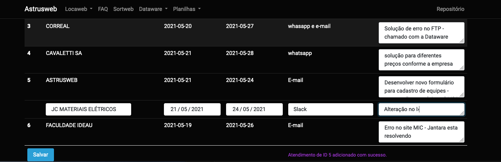
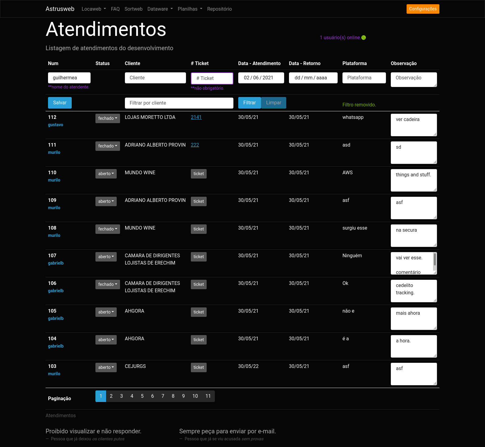

# Atendimento To-Do!

Planilhas dinâmicas para registro de atendimentos do suporte - Astrusweb.

Objetivos:

1. Agilizar registros de atividades do suporte técnico.
2. Facilitar consulta interna das atividades delegadas para a equipe de desenvolvimento.
3. Contabilizar tempo dedicado no atendimento ao cliente.
4. Integrar com o software Sortweb, buscando melhor prestação de contas do direcionamento do tempo útil da equipe.

Informações técnicas:

- Backend em [node.js](https://nodejs.org/) v15.14.0
- Roteamento e api em [express.js](https://expressjs.com/) v4.17.1
- [socket.io](https://socket.io/) v4.1.2 para manter planilhas sincronizadas entre usuários.
- Banco de dados mysql 5.7, através do [mysql2](https://www.npmjs.com/package/mysql2) v2.2.5
- Lógica do frontend desenvolvido em notação ES6, recomendado uso de navegadores firefox e chrome.
- Estilização e UX em [bootstrap](https://getbootstrap.com/) com o tema [cyborg](https://bootswatch.com/cyborg/)


## GLITCHES

*Pendentes*

- em alguns casos a aba registros do usuário não está sendo populada, sem deixar nenhum erro no console.
- ao marcar uma opção de filtro, por ex. aberto e deletado, e dar F5, o navegador mantém as checkbox marcadas mas não ativa o filtro.
- Na barra de busca, se a pessoa apertar ENTER antes de selecionar um cliente, ele atualiza a página. FIX: ao apertar enter, filtrar pelo primeiro resultado da lista.
- Caso a pessoa estiver filtrando por atendimentos fechados, e outro usuário inserir uma linha, ela vai aparecer mesmo assim.
- Validação do user\_id na inserção de linha, acho que tá deixando passar pro query no banco ids que não existem. verificar e fazer igual tá com a verificação do client\_id.
- Evitar que a pessoa possa enviar várias vezes o mesmo filtro, por ex, travar o filtro pelo cliente que já está sendo filtrado...
- Criar conexão com o banco uma única vez, ao invés de criar toda vez que é feito um query:
```javascript
const mysql = require('mysql2/promise');
const config = require('./config');
// const connection = await mysql.createConnection(config);
// passar connection como parametro nas funções

async function query(sql, params = null) {
  const connection = await mysql.createConnection(config);
  const [results, ] = await connection.execute(sql, params);
  return results;
}
```
- Aplica o filtro com o perPage em 10, num cliente que tem 30 entradas. Altera o perPage pra 100 e clica na terceira página => cai numa página com 100% filler rows.
- Quando um usuário estiver utilizado o filtro, ele já carregou os clientes com atendimento no cache. Se for criado um atendimento pra um cliente diferente dos que existiam, ele não vai aparecer na listagem de clientes pra filtro até que o usuário atualize a página.
- Alguns clientes quando são colocados no filtro, retornam a listagem com todas as linhas filler (possivelmente pq os atendimentos deles estão todos deletados)
- Quando entra no campo cliente sem clicar, dá aquele proble a do bootstrap que precisa de um .click()
- Após uso do filtro e remoção, verificar se os hooks do socket voltam a funcionar normalmente.

*Resolvidos*

- inserção de linhas quando usuário está com o form aberto: **colocado form de inserção no cabeçalho.**

- Quando o cliente faz muitas requisições sem retorno, ou quando a conexão cai na metade, etc, acaba dando o erro abaixo. Ocorre também se a pessoa fica clicando loucamente pra filtrar: **adicionei uma linha terminando a conexão após cada query** 
> Error: Too many connections
>     at Object.createConnection (/Users/guilhermegarcia/Node/sockettables/socket-tables/node_modules/mysql2/promise.js:241:31)
>     at query (/Users/guilhermegarcia/Node/sockettables/socket-tables/db/db.js:5:34)
>     at Object.countAtendimentos (/Users/guilhermegarcia/Node/sockettables/socket-tables/db/db.js:52:23)
>     at /Users/guilhermegarcia/Node/sockettables/socket-tables/index.js:140:24
>     at Layer.handle [as handle_request] (/Users/guilhermegarcia/Node/sockettables/socket-tables/node_modules/express/lib/router/layer.js:95:5)
>     at next (/Users/guilhermegarcia/Node/sockettables/socket-tables/node_modules/express/lib/router/route.js:137:13)
>     at Route.dispatch (/Users/guilhermegarcia/Node/sockettables/socket-tables/node_modules/express/lib/router/route.js:112:3)
>     at Layer.handle [as handle_request] (/Users/guilhermegarcia/Node/sockettables/socket-tables/node_modules/express/lib/router/layer.js:95:5)
>     at /Users/guilhermegarcia/Node/sockettables/socket-tables/node_modules/express/lib/router/index.js:281:22
>     at Function.process_params (/Users/guilhermegarcia/Node/sockettables/socket-tables/node_modules/express/lib/router/index.js:335:12) {
>   code: 'ER\_CON\_COUNT\_ERROR',
>   errno: 1040,
>   sqlState: ''
> }
## Alterações (To-do list da to-do list!)

Implementar

- Filtro por número de ticket (o ctr F com o número do ticket sempre vem o com 0 a mais..)
- puxar x ultimos registros quando a pessoa carregar a página
- colocar um overflow na ul dos registros
- opção de clicar no registro pra ver detalhes, ou criar página com todos os registros?
- opção de clicar no atendimento pra ver histórico
- utilizar esquema de popup.
- Remover atendimento / editar atendimento inteiro ?
- Esquema para "travar" o texto de um status passado. Por ex, quando um atendimento for fechado, o texto dele "aberto" não pode mais ser alterado. Se a pessoa quiser adicionar informações, tem que abrir novamente.
- Permitir escrever nas observações apenas para atendimentos em aberto.
- Permitir editar número de ticket apenas para atendimentos em aberto.
- Campo "Conclusão": adicionar um comentário na hora de fechar o atendimento.
- Integração sortweb: registro de tickets via API.
- Tiver placeholder do ticket

Já feito

- Aceitar número de OS;
- Adicionar campo que diz se o atendimento já foi concluído: optei por colocar um dropdown com status do atendimento, assim posso criar mais status no futuro;
- Pop up para confirmar deleção de atendimento;
- Paginação, mais novos por último, botão de novo atendimento em cima.
- Adicionar campo com o nome do atendente (deixar pré-populado via cookie/sessão): optei por um cookie js até que seja definido a forma como vai ser autenticado nos envios pro sortweb. Depois, posso pensar em um sistema de login pra gerar uma chave no sort, algo do tipo.
- Filtro por nome de cliente;
- Agora que a lista mostra os clientes inativos, avisar na hora de criar OS
  o status do cliente: **decidi bloquear a criação de atendimentos pra clientes inativos, visto que não pode ser gerado OS. Precisa ser registrado no nome da AstrusWeb, com o cliente na descrição.**
- Adicionar tabela atendimentos\_status, com registro (data e hora) de quando cada atendimento foi aberto / reaberto / deletado.
- Filtro de status de atendimento.

#### DB MIGRATIONS

status do atendimento:

```sql
CREATE TABLE status (id INT NOT NULL AUTO_INCREMENT, name VARCHAR(255), PRIMARY KEY(id));
ALTER TABLE atendimentos ADD COLUMN status_id INT NOT NULL DEFAULT 1 AFTER id;
INSERT INTO status (name) VALUES ('aberto'), ('fechado');
ALTER TABLE atendimentos ADD FOREIGN KEY(status_id) REFERENCES status(id);
```

table usuarios:

```sql
CREATE TABLE usuarios (id INT NOT NULL AUTO_INCREMENT, sort_id INT NOT NULL, username VARCHAR(13) NOT NULL, role VARCHAR(25) NOT NULL, active TINYINT NOT NULL DEFAULT 1, PRIMARY KEY(id));
ALTER TABLE atendimentos ADD COLUMN user_id INT(11) AFTER id;
ALTER TABLE usuarios ADD UNIQUE (sort_id);
ALTER TABLE atendimentos ADD FOREIGN KEY(user_id) REFERENCES usuarios(sort_id);
INSERT INTO usuarios (sort_id, username, role) VALUES ("16","jantara","programador"), ("50","murilo","programador"), ("55","gustavo","programador"), ("69","mlucas","programador"), ("70","gabrielb","programador"), ("84","guilhermea","suporte"), ("104","felipe","programador"), ("105","andressa","suporte");
```

habilitar log de alterações:

```sql
CREATE TABLE auditlogs(id INT(11) PRIMARY KEY AUTO_INCREMENT, tipo VARCHAR(255) NOT NULL, tabela VARCHAR(255) NOT NULL, user_id INT NOT NULL, tabela_pk INT NOT NULL, FOREIGN KEY (user_id) REFERENCES usuarios(sort_id));
CREATE TABLE auditlogdetalhes(id INT PRIMARY KEY AUTO_INCREMENT, log_id INT NOT NULL, nome_coluna VARCHAR(255) NOT NULL, valor_antigo TEXT, valor_novo TEXT NOT NULL, FOREIGN KEY (log_id) REFERENCES auditlogs(id));
ALTER TABLE auditlogs ADD COLUMN criado_em DATETIME DEFAULT NOW();
```

##### Evolução do layout

1. ~02/06/2021

