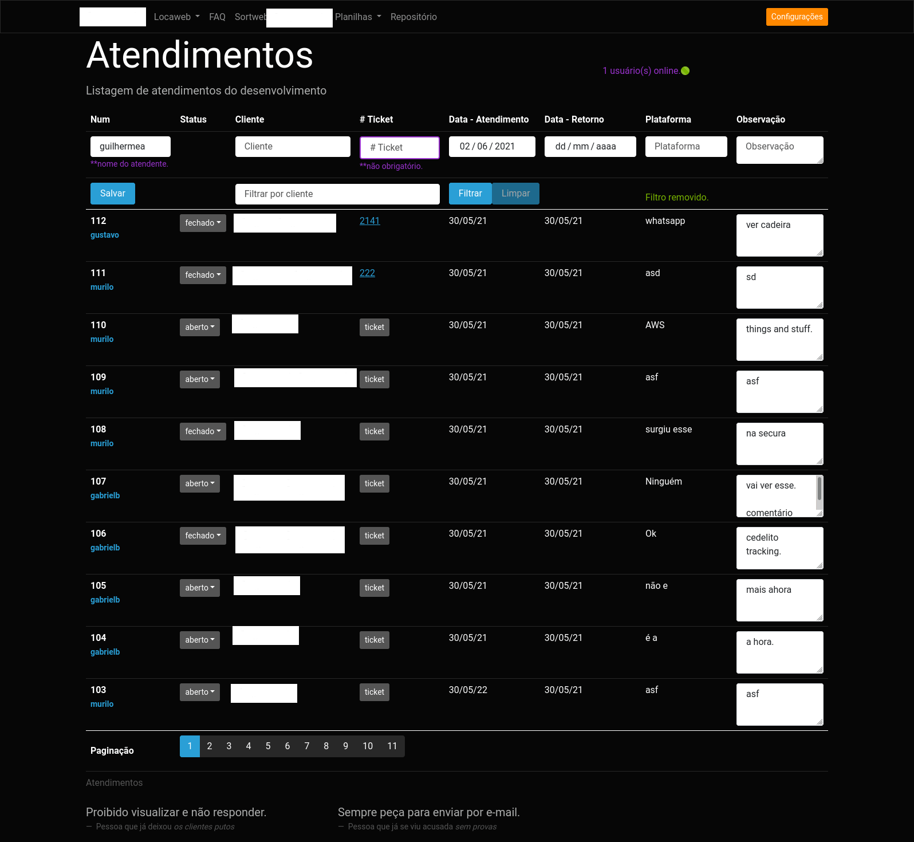
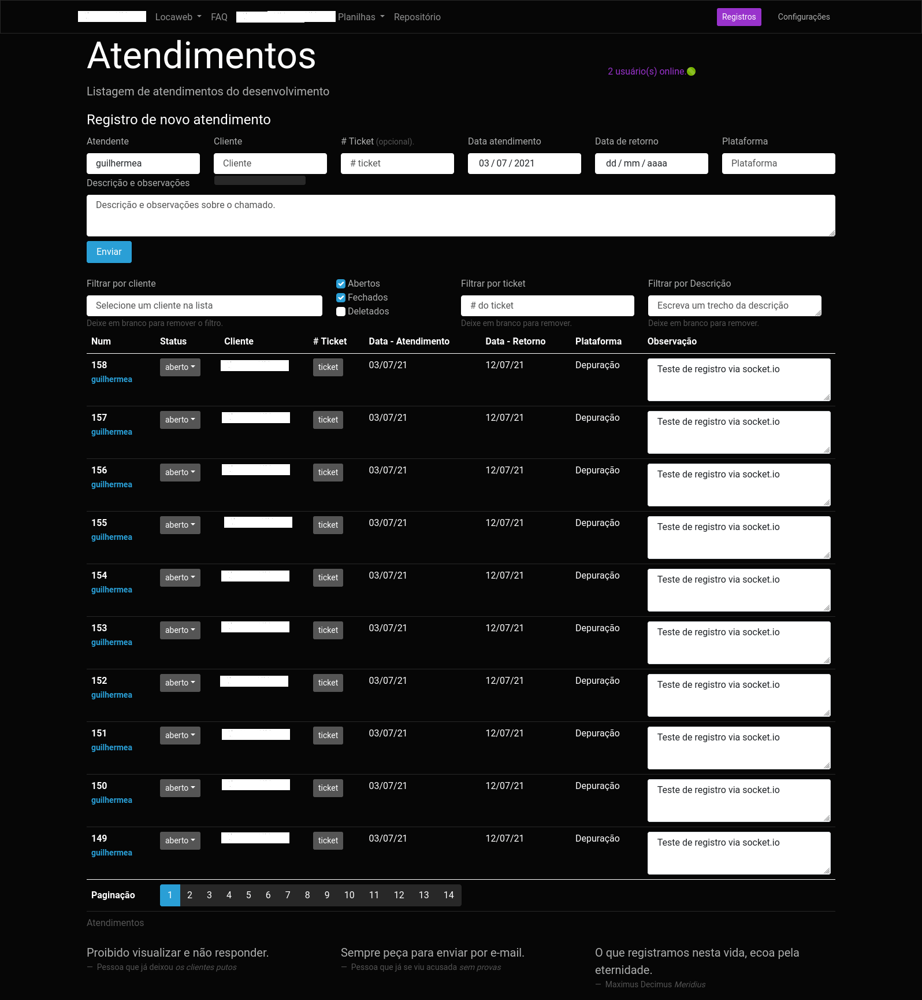

# Atendimento To-Do!

Dynamic tables to register technical support tickets.

Objectives:

1. Facilitate registration of technical support tickets.
2. Faster search for tasks delegated to the development team.
3. Account for time dedicated in customer service.
4. Integrate to different project management services via API.

Technical information:

- Backend in [node.js](https://nodejs.org/) v15.14.0
- Routing and API in [express.js](https://expressjs.com/) v4.17.1
- [socket.io](https://socket.io/) v4.1.2 to sync table updates between different users.
- Database mysql 5.7, via [mysql2](https://www.npmjs.com/package/mysql2) v2.2.5
- Frontend using ES6 notation.
- Styles and UX based on [bootstrap](https://getbootstrap.com/) using [cyborg](https://bootswatch.com/cyborg/) theme.

## Implementations (To-do list's to-do list!)

Pending Features

- when searching for 'c', find results with 'ç', 'a', 'á', etc...
- filter calls without ticket
- show latest logs on pageload
- add overflow to log's ul
- show log detail on click, or perhaps create a separate page with detailed log info
- show historic of changes made to specific call on click
- Remove call / edit fields other than description
- Block editon of closed call's description. Ex, for a closed call, users would not be able to change the description without reopening the call.
- Add a 'conclusion' text field to the calls, and have users fill it when status change to closed.
- Integrate with an endpoint to close specific activities, so the user can close that activity when the call status changes to 'closed' \(needs a textfield to fill in activity description\).
- Enable image upload via drag &amp; drop;

#### DB MIGRATIONS

call status

```sql
CREATE TABLE status (id INT NOT NULL AUTO_INCREMENT, name VARCHAR(255), PRIMARY KEY(id));
ALTER TABLE atendimentos ADD COLUMN status_id INT NOT NULL DEFAULT 1 AFTER id;
INSERT INTO status (name) VALUES ('aberto'), ('fechado');
ALTER TABLE atendimentos ADD FOREIGN KEY(status_id) REFERENCES status(id);
```

table usuarios:

```sql
CREATE TABLE usuarios (id INT NOT NULL AUTO_INCREMENT, sort_id INT NOT NULL, username VARCHAR(13) NOT NULL, role VARCHAR(25) NOT NULL, active TINYINT NOT NULL DEFAULT 1, PRIMARY KEY(id));
ALTER TABLE atendimentos ADD COLUMN user_id INT(11) AFTER id;
ALTER TABLE usuarios ADD UNIQUE (sort_id);
ALTER TABLE atendimentos ADD FOREIGN KEY(user_id) REFERENCES usuarios(sort_id);
INSERT INTO usuarios (sort_id, username, role) VALUES ("16","jantara","programador"), ("50","murilo","programador"), ("55","gustavo","programador"), ("69","mlucas","programador"), ("70","gabrielb","programador"), ("84","guilhermea","suporte"), ("104","felipe","programador"), ("105","andressa","suporte");
```

enable logs:

```sql
CREATE TABLE auditlogs(id INT(11) PRIMARY KEY AUTO_INCREMENT, tipo VARCHAR(255) NOT NULL, tabela VARCHAR(255) NOT NULL, user_id INT NOT NULL, tabela_pk INT NOT NULL, FOREIGN KEY (user_id) REFERENCES usuarios(sort_id));
CREATE TABLE auditlogdetalhes(id INT PRIMARY KEY AUTO_INCREMENT, log_id INT NOT NULL, nome_coluna VARCHAR(255) NOT NULL, valor_antigo TEXT, valor_novo TEXT NOT NULL, FOREIGN KEY (log_id) REFERENCES auditlogs(id));
ALTER TABLE auditlogs ADD COLUMN criado_em DATETIME DEFAULT NOW();
```

##### Layout changes

1. ~02/06/2021

2. ~03/07/2021

